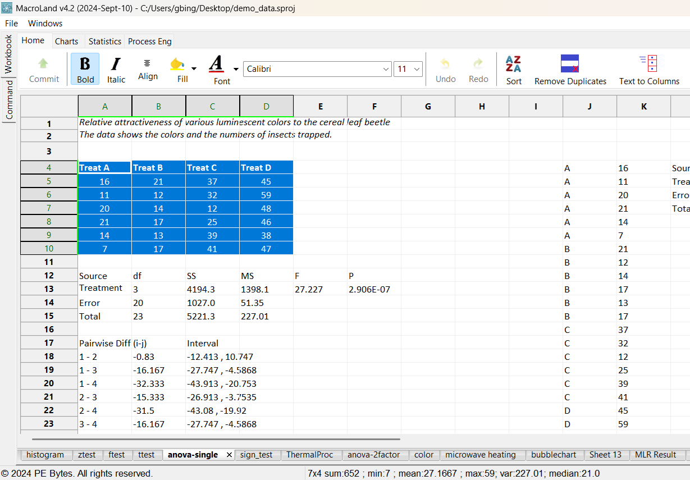

# An extensible and highly customizable computing environment for engineers.

#### Most parts are written in C++ and uses Python for extending and customizing the framework.

### It relies on the following libraries:
- wxWidgets
- wxPython

&nbsp;

### The main frame is essentially comprised of 3 parts:
1. Workbook
2. Command window
3. Apps

## Workbook
Among the several function of workbook, most notable ones are:
1. Saving, loading and manipulating data,
2. Creating a Python variable from a selection,

&nbsp;

## Command-window 
The command-window (integrated with workbook) serves:  
1. To work on a variable created via workbook,
2. To export a Python variable to the workbook,
3. To run multiple or single line commands,
4. To assist in writing a command by offering code completion.

&nbsp;

## Extensions
Currently there are 4 toolbar pages:  

**Note*:* Except the *Home* page, the rest are added dynamically by extensions.  

- Home (Default first page)  

- Charts  

- Statistics  

- Process Engineering  

&nbsp;

## Apps

Different apps can be developed from merely computational to apps which work directly using the data 
from the workbook (similar to spreadsheet software). For example, once a selection is made 
and an app is started, the range is shown (can be modified later on as well):

