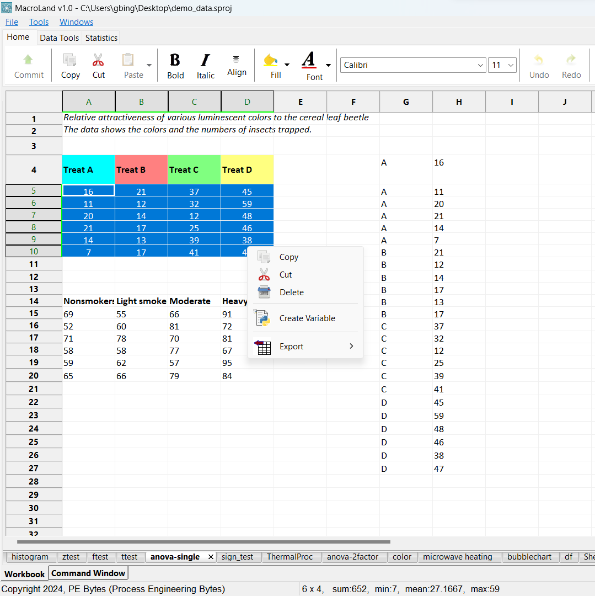

## MacroLand

MacroLand is an extensible and configurable environment for Python scripts. 


## License
MacroLand is licensed under the GNU General Public License (GPL) Version 3.


&nbsp;

## Objective 

Python has many libraries for different purposes. For example, a simple t-test can be 
performed in the following way:

```Python
import pprint
from scisuit.stats import test_t

treat = [24, 43, 58, 71, 43, 49, 61, 44, 67, 49]
cont = [42, 43, 55, 54, 20, 85, 33, 41, 19, 60, 53, 42]

pval, tbl = test_t(x=treat, y=cont, varequal=False)

print("p-value=" + str(pval))
pprint.pprint(tbl) 
```

Once a script like above-shown one is successfully implemented, imagine how
easy it would be if variables `treat` and `cont` were columns of data in 
a spreadsheet and you would be selecting them as you would in a spreadsheet software.

Below app simply demonstraes this purpose.


&nbsp;

MacroLand provides all the tools to embed your wxPython app (or a regular Python script) 
to different parts of the spreadsheet, be it right-click menu, a new toolbar, taskbar...



&nbsp;


## Compilation or Download

Just visit https://www.pebytes.com to download a compiled version.

### Compilation

Although Visual Studio solution and project files are provided,
you need extra steps:

- Install Python with debug libraries.
- Get Lua, wxWidgets and Boost (linking will be required).
- C++20 or higher  
